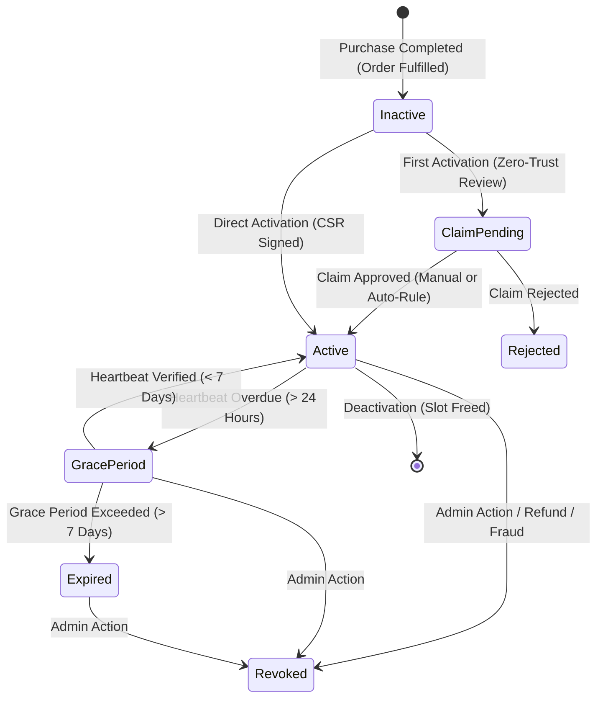
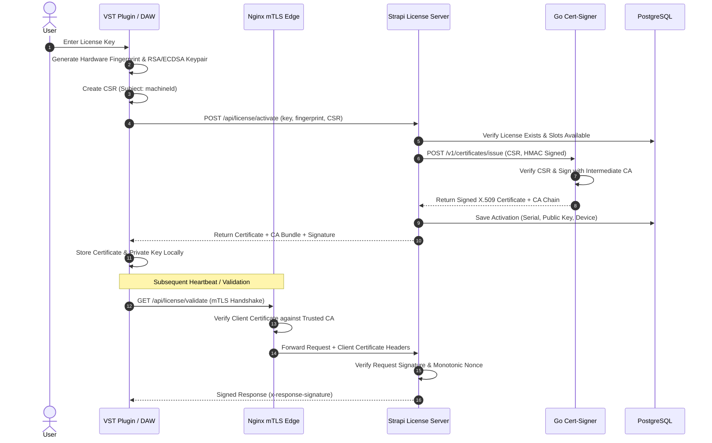

# 🏛️ System Architecture Specification

## 1. System Overview & Monorepo Topology

Samplero is a high-availability, zero-trust digital rights management (DRM) and commerce platform engineered for audio software (VST, AU, AAX plugins) and digital soundware (sample packs, preset libraries).

```
                      ┌──────────────────────────────────────────────┐
                      │              Edge Proxy (Nginx)              │
                      │  Port 8443: mTLS / HTTPS SSL Termination     │
                      └──────────────────────┬───────────────────────┘
                                             │
                       ┌─────────────────────┴─────────────────────┐
                       │                                           │
                       ▼                                           ▼
         ┌───────────────────────────┐               ┌───────────────────────────┐
         │       Web / Client        │               │   Backend Engine (Node)   │
         │   Customer Portal / App   │               │   Strapi 5 (License Srv)  │
         │   Port 80 / Static HTML   │               │   Port 1337 (HTTP JSON)   │
         └───────────────────────────┘               └─────────────┬─────────────┘
                                                                   │
                               ┌───────────────────────────────────┼───────────────────────────────────┐
                               │                                   │                                   │
                               ▼                                   ▼                                   ▼
                 ┌───────────────────────────┐       ┌───────────────────────────┐       ┌───────────────────────────┐
                 │    Database (PostgreSQL)  │       │    Cache & Freshness      │       │    PKI Signer (Go Lang)   │
                 │    Port 5432              │       │    Redis (Port 6379)      │       │    Port 8081 (Step-CA)    │
                 └───────────────────────────┘       └───────────────────────────┘       └───────────────────────────┘
```

---

## 2. Component Directory

| Component | Technology | Role |
| :--- | :--- | :--- |
| **Strapi Core & Plugin** | Node.js 22, TypeScript, Strapi 5 | Core business logic, RBAC, commerce orders, license state machine, response signing |
| **Cert-Signer** | Go 1.24+ (Zero external deps) | Hardened microservice for CSR processing, X.509 issuance, and Step-CA integration |
| **Tauri Desktop App** | Rust, Tauri 2.0, React 18, TS | Hardware fingerprinting, CSR creation, background heartbeat worker, secure license storage |
| **Flutter Mobile App** | Dart, Flutter 3.x | Customer catalog browsing, order history, license inspection |
| **Edge Gateway** | Nginx 1.27 Alpine | TLS 1.3 termination, client certificate mTLS validation, rate limiting, header forwarding |
| **Search Engine** | Meilisearch | High-performance full-text search for soundware and plugin versions |
| **Asset Storage** | AWS S3 | Encrypted object storage with presigned download URL generation |

---

## 3. Customer Portal Architecture

The buyer-facing web workspace is implemented as a **static customer portal** served from `public/customer/`:
- **Routes**:
  - `#/store` — storefront and featured products
  - `#/products/:slug` — product detail + latest versions + order CTA
  - `#/account/licenses` — license cabinet
  - `#/account/licenses/:id` — license detail + recovery workspace
  - `#/account/downloads` — download hub
  - `#/account/orders` — order history
  - `#/account/orders/:id` — order detail + post-purchase CTA
- **Endpoints**:
  - `POST /api/license-server/orders`
  - `POST /api/license-server/me/orders/:id/redeem-coupon`
  - `GET /api/license-server/me/licenses`
  - `GET /api/license-server/me/downloads`
  - `GET /api/license-server/me/orders`

---

## 3. License Verification & Activation State Machine



### Protocol Flow: Online Activation with Proof-of-Possession



---

## 4. Anti-Tamper & Proof-of-Possession Rules

1. **Request Canonicalization**:
   - `Validate`: `GET` requests must supply `x-request-signature = HMAC/Ed25519(canonical_query, client_private_key)`.
   - `Heartbeat`: `POST` requests must supply `x-payload-signature = HMAC/Ed25519(json_body, client_private_key)`.
2. **Freshness Window**:
   - Every request must contain `x-request-timestamp` (Unix seconds).
   - Skew delta cannot exceed `LICENSE_FRESHNESS_MAX_SKEW_SECONDS` (default: 300 seconds).
3. **Replay Defense**:
   - `x-request-nonce` must be unique per scope and is stored in Redis with TTL equal to freshness window.
4. **Server Response Signature**:
   - Every API response is decorated with `x-response-signature: base64(HMAC_SHA256(body, LICENSE_SERVER_SECRET))`.

---

## 5. High Availability & Disaster Recovery Topology

- **Database**: PostgreSQL 16/17 with Connection Pooling (`pgBouncer`), read-replicas, and WAL archiving.
- **Cache**: Redis 7 cluster with in-memory eviction policies and persistence (`AOF`/`RDB`).
- **Idempotency**: All payment webhooks, activation requests, and CSR issuances are idempotent by transaction ID and nonces.
