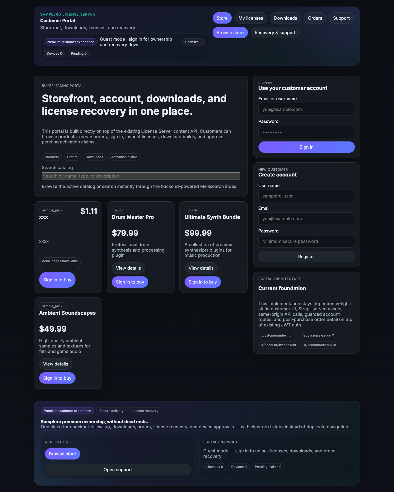
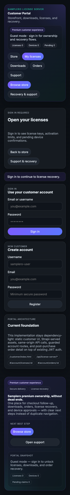
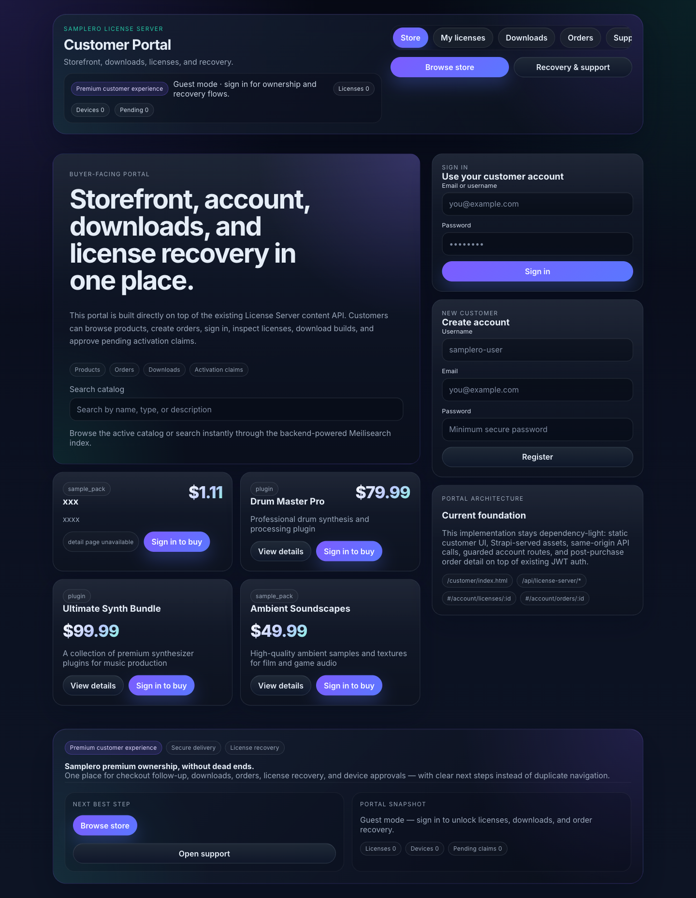
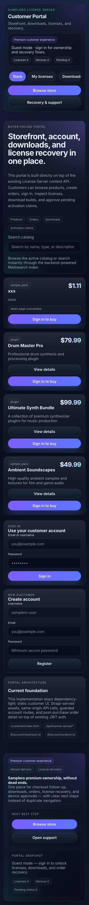
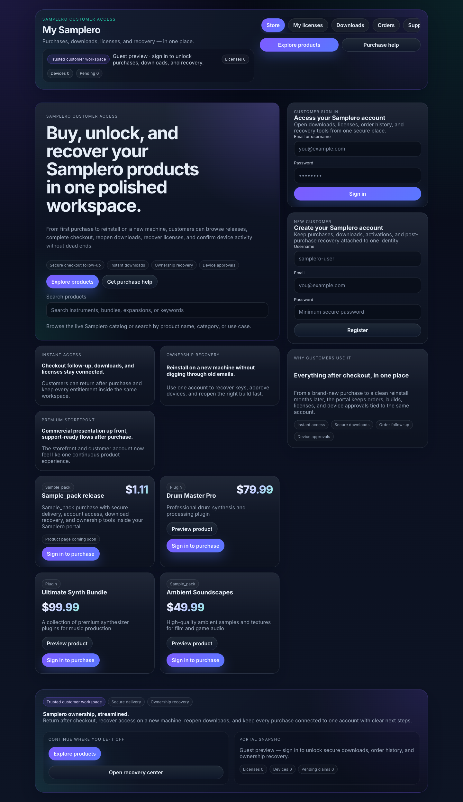
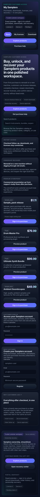
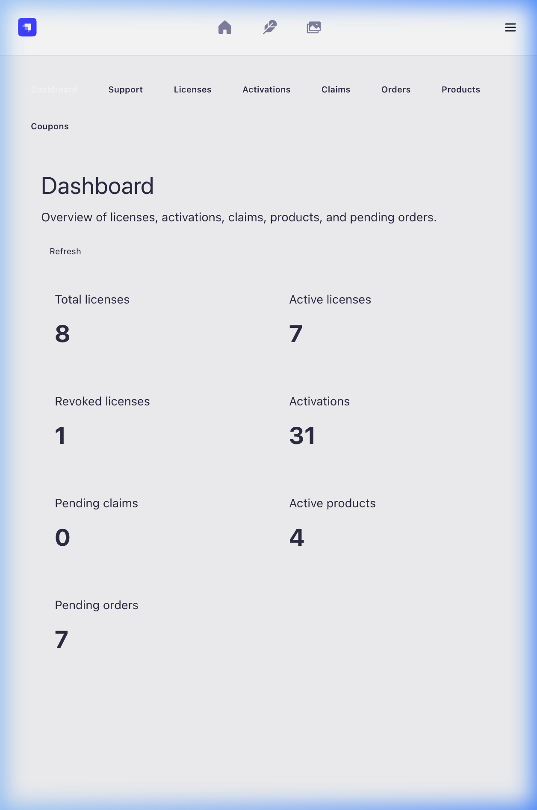
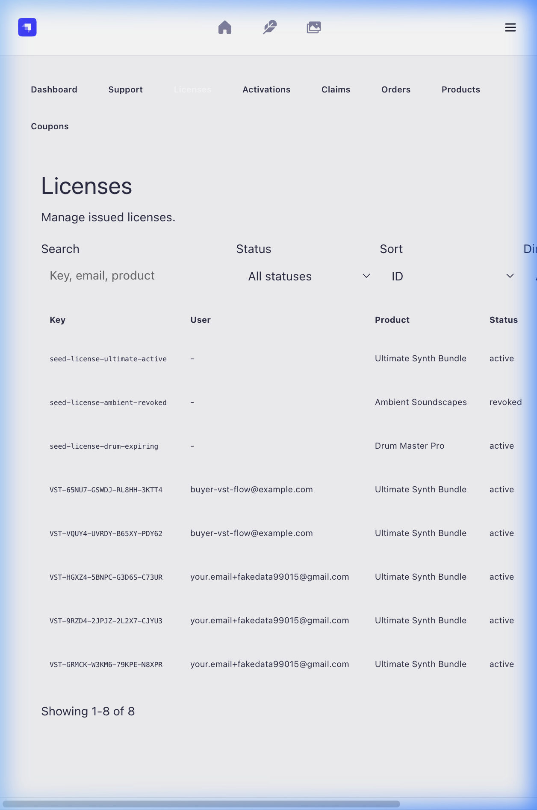
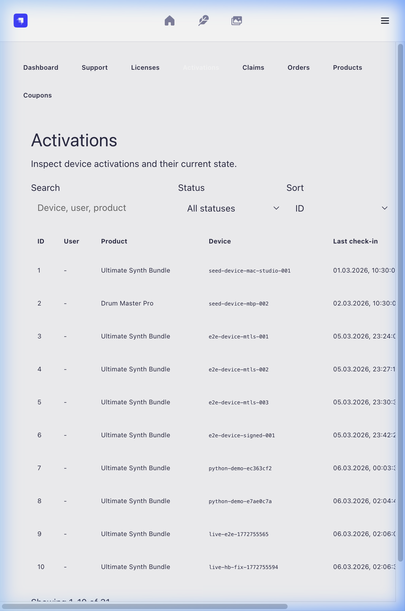
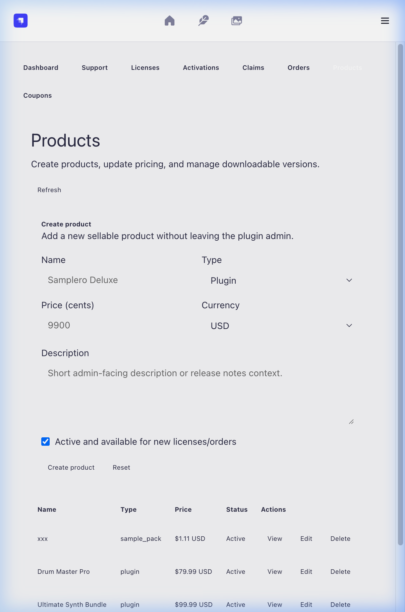

# Samplero — License Server

A production-grade license server for VST plugins and sample packs, built on **Strapi 5**. Handles purchase fulfillment, device activation, certificate issuance, and offline grace periods — secured end-to-end with **mTLS + signed requests**.

---

## Table of Contents

- [Screenshots](#screenshots)
- [Architecture](#architecture)
- [Tech Stack](#tech-stack)
- [Project Structure](#project-structure)
- [Quick Start (Local Dev)](#quick-start-local-dev)
- [Docker Stack](#docker-stack)
- [Environment Variables](#environment-variables)
- [Security Model](#security-model)
- [API Overview](#api-overview)
- [PKI & Certificate Management](#pki--certificate-management)
- [Running Tests](#running-tests)
- [Deployment](#deployment)
- [Roadmap](#roadmap)

---

## Screenshots

### Customer Portal — Storefront, Downloads & License Recovery

| Desktop | Mobile |
|---|---|
|  |  |

### Customer Portal — Production

| Desktop | Mobile |
|---|---|
|  |  |

### My Samplero — Unified Ownership Workspace

| Desktop | Mobile |
|---|---|
|  |  |

### Admin Panel — License Server Plugin

| Dashboard | Licenses |
|---|---|
|  |  |

| Activations | Products |
|---|---|
|  |  |

---

## Architecture

```
Customer / Plugin
       │
       ▼
  nginx (port 8443)
  mTLS termination
       │
       ├─── /api/license/*  ────────────────► Strapi (port 1337, internal)
       │                                        │
       │                                        ├── strapi-plugin-license-server
       │                                        │     ├── license service
       │                                        │     ├── purchase / fulfillment
       │                                        │     ├── crypto / signing
       │                                        │     └── admin UI panel
       │                                        │
       │                                        └── cert-signer (Go, port 8081)
       │                                              ├── local CA mode
       │                                              └── step-ca mode
       │
       ├─── /api/license-server/me/*  ─────► customer cabinet (orders, licenses, downloads)
       └─── /api/license-server/webhooks/payment  ─► payment fulfillment
```

**Services:**

| Service | Role |
|---|---|
| `strapi` | Core API, admin panel, business logic |
| `cert-signer` | Go microservice — signs CSRs and issues client certificates |
| `strapiDB` | PostgreSQL 16 — persistent storage |
| `strapi-redis` | Redis 7 — rate-limit state |
| `nginx` | TLS/mTLS edge proxy |

---

## Tech Stack

| Layer | Technology |
|---|---|
| API framework | [Strapi 5](https://strapi.io) (Node.js) |
| Database | PostgreSQL 16 (SQLite supported for dev) |
| Cache / rate-limit | Redis 7 |
| Cert issuance | Go `cert-signer` + optional [smallstep `step-ca`](https://smallstep.com/docs/step-ca/) |
| Edge proxy | nginx 1.27 with mTLS |
| Container runtime | Docker Compose |
| Test runner | [Bun](https://bun.sh) (193 tests) |
| Customer portal | Tauri app (`apps/customer-tauri`) |

---

## Project Structure

```
.
├── config/                   # Strapi config (database, plugins, middleware, server)
├── src/
│   ├── admin/                # Admin panel extensions & Vite config
│   └── extensions/           # users-permissions server patch
├── plugins/
│   ├── license-server/       # Core custom plugin (controllers, services, policies, admin UI)
│   └── strapi-plugin-rate-limit/  # Vendored rate-limit plugin
├── services/
│   └── cert-signer/          # Go CSR-signing microservice
├── apps/
│   └── customer-tauri/       # Customer desktop portal (Tauri)
├── docker/
│   ├── docker-compose.yml    # Main stack
│   ├── docker-compose.stepca.yml  # step-ca overlay
│   ├── nginx/                # nginx config templates
│   └── pki-stack.sh          # PKI-aware compose wrapper
├── scripts/
│   └── pki/                  # CA bootstrap, bundle build/install, rollout/rollback helpers
├── tests/                    # Bun test suites (unit + HTTP integration)
├── docs/                     # Wireframes and design docs
├── .docker-pki/              # Local PKI state (gitignored)
└── certs/                    # nginx server TLS certs (gitignored)
```

---

## Quick Start (Local Dev)

### Prerequisites

- Node.js 18–22
- npm ≥ 6 (or Bun)
- Docker + Docker Compose
- Go 1.22+ (only if building `cert-signer` locally)

### 1. Install dependencies

```bash
npm install
```

### 2. Configure environment

```bash
cp docker/.env.example .env
# Edit .env — at minimum set JWT_SECRET, ADMIN_JWT_SECRET, APP_KEYS, LICENSE_SERVER_SECRET
```

### 3. Bootstrap the dev PKI

```bash
bash scripts/pki/bootstrap-step-ca.sh
```

This generates a local root CA, intermediate CA, and server TLS certs under `.docker-pki/`.

### 4. Start the full Docker stack

```bash
bash docker/pki-stack.sh up
```

Or with step-ca as the issuance backend:

```bash
docker compose -f docker/docker-compose.yml -f docker/docker-compose.stepca.yml up
```

### 5. Run Strapi in dev mode (without Docker)

```bash
npm run develop
```

Strapi admin panel will be available at `http://localhost:1337/admin`.

---

## Docker Stack

The `pki-stack.sh` wrapper manages the PKI user context and exposes the standard compose commands:

```bash
bash docker/pki-stack.sh up       # Start all services
bash docker/pki-stack.sh down     # Stop services
bash docker/pki-stack.sh restart  # Restart
bash docker/pki-stack.sh status   # Show status
```

**Exposed ports:**

| Port | Service |
|---|---|
| `8443` | nginx mTLS edge (external) |
| `1337` | Strapi (localhost only, internal) |
| `5432` | PostgreSQL |
| `6379` | Redis |

---

## Environment Variables

Copy `docker/.env.example` to `.env` and fill in the required values.

### Core Strapi

| Variable | Description |
|---|---|
| `JWT_SECRET` | Strapi JWT secret (required) |
| `ADMIN_JWT_SECRET` | Admin panel JWT secret (required) |
| `APP_KEYS` | Comma-separated app keys (required) |
| `DATABASE_CLIENT` | `postgres` or `sqlite` |
| `DATABASE_*` | PostgreSQL connection settings |
| `REDIS_URL` | Redis connection URL |

### License Server

| Variable | Description | Default |
|---|---|---|
| `LICENSE_SERVER_SECRET` | HMAC key for response signing | — (required) |
| `LICENSE_WEBHOOK_SECRET` | Dedicated webhook HMAC secret | — (required) |
| `LICENSE_SIGNER_MODE` | `local` or `remote` | `remote` |
| `LICENSE_SIGNER_URL` | cert-signer base URL | `http://cert-signer:8081` |
| `LICENSE_SIGNER_AUTH_TOKEN` | Auth token for signer requests | — |
| `LICENSE_SIGNER_SHARED_SECRET` | HMAC shared secret for signer freshness | — |
| `LICENSE_GRACE_PERIOD_DAYS` | Offline grace period | `7` |
| `LICENSE_HEARTBEAT_HOURS` | Heartbeat interval | `24` |
| `LICENSE_MAX_ACTIVATIONS` | Default activation slots per license | `3` |
| `LICENSE_REQUIRE_MTLS` | Enforce mTLS on validate/heartbeat | `true` |
| `LICENSE_MTLS_ENDPOINT` | Public mTLS base URL shown to clients | `https://api` |
| `LICENSE_FRESHNESS_MAX_SKEW_SECONDS` | Max clock skew for request freshness | `300` |
| `LICENSE_WEBHOOK_ALLOWED_IPS` | Optional IP allowlist for payment webhook | — |

### cert-signer (Go)

| Variable | Description |
|---|---|
| `CERT_SIGNER_AUTH_TOKEN` | Must match `LICENSE_SIGNER_AUTH_TOKEN` |
| `CERT_SIGNER_AUTH_SHARED_SECRET` | Must match `LICENSE_SIGNER_SHARED_SECRET` |
| `CERT_SIGNER_CA_CERT_PATH` | Path to intermediate CA cert |
| `CERT_SIGNER_CA_KEY_PATH` | Path to intermediate CA private key |
| `CERT_SIGNER_CA_CHAIN_PATH` | Path to full CA chain |
| `CERT_SIGNER_VALIDITY_DAYS` | Client cert validity in days |

---

## Security Model

### mTLS

- nginx terminates client TLS and passes `X-Client-Cert-Serial`, `X-Client-Cert-DN`, and `X-SSL-Verified` headers to Strapi.
- The `verify-mtls` policy validates the cert serial against the `Activation` table.
- Requests without a valid client cert are rejected with `403` at nginx.

### Request Signing

For activations that include a `client_public_key`, both the API-key path and the mTLS path enforce **proof-of-possession**:

- `X-Request-Signature`: HMAC or ECDSA signature over canonical request body.
- `X-Payload-Signature`: Signature over the full payload.
- Any post-signature tampering of `license_key` or `device_fingerprint` is detected and rejected (`401 INVALID_REQUEST_SIGNATURE`).
- `heartbeat` does not update `last_checkin` until the signature is successfully verified.

### Trust Levels

| Level | Requirements |
|---|---|
| `MTLS_SIGNED` | Valid client cert + valid request signature |
| `SIGNED` | Valid API key + valid request signature |

### Response Signing

A global middleware signs all API responses with `LICENSE_SERVER_SECRET` so clients can detect tampering.

### Rate Limiting

Per-route limits enforced via `strapi-plugin-rate-limit` (vendored):

| Endpoint | Limit |
|---|---|
| `POST /license/activate` | 10 / min |
| `POST /license/heartbeat` | 60 / min |
| `GET /license/validate` | 100 / min |

---

## API Overview

All endpoints are under `/api/license-server/`.

### Plugin Lifecycle

| Method | Path | Auth | Description |
|---|---|---|---|
| `POST` | `/license/activate` | API key / mTLS | Activate a license on a device; issues client cert |
| `GET` | `/license/validate` | mTLS + signature | Validate an active license |
| `POST` | `/license/heartbeat` | mTLS + signature | Check in; resets offline timer |
| `POST` | `/license/deactivate` | Bearer JWT | Deactivate a specific device |
| `GET` | `/license/status` | Bearer JWT | Get license and activation status |

### Customer Cabinet

| Method | Path | Auth | Description |
|---|---|---|---|
| `GET` | `/me/orders` | Bearer JWT | List customer orders |
| `GET` | `/me/licenses` | Bearer JWT | List customer licenses |
| `GET` | `/me/downloads` | Bearer JWT | List available downloads |

### Commerce / Fulfilment

| Method | Path | Auth | Description |
|---|---|---|---|
| `POST` | `/webhooks/payment` | Webhook secret | Payment provider callback; triggers fulfillment |

### Admin (Strapi panel + API)

| Method | Path | Auth | Description |
|---|---|---|---|
| `GET` | `/license-server/licenses` | Admin JWT | List all licenses |
| `GET` | `/license-server/activations` | Admin JWT | List all activations |
| `POST` | `/license-server/licenses/:id/revoke` | Admin JWT | Revoke a license |
| `POST` | `/license-server/activations/:id/deactivate` | Admin JWT | Deactivate a slot |

### Products

| Method | Path | Auth | Description |
|---|---|---|---|
| `GET` | `/products` | Public | List active products |
| `GET` | `/products/:slug` | Public | Get product by slug |
| `GET` | `/products/:id/versions` | Public | List plugin versions |
| `GET` | `/products/:id/versions/:vid/download` | Bearer JWT | Get presigned S3 download URL |

See [`openapi.md`](./openapi.md) for the full OpenAPI 3.0 specification.

---

## Offline Grace Period

When a device cannot reach the server:

1. `validate` returns `grace_period` status — the license remains valid offline.
2. After `LICENSE_GRACE_PERIOD_DAYS`, `validate` returns `grace_period_expired`.
3. The first successful online `heartbeat` restores `active` status and resets the offline budget.

---

## PKI & Certificate Management

See [`docs-pki-runbook.md`](./docs-pki-runbook.md) for the full runbook covering:

- Root CA generation (offline, air-gapped)
- Intermediate CA issuance and custody
- cert-signer deployment (local mode vs step-ca mode)
- nginx trust configuration
- Canary rollout and rollback procedures

### Key scripts

| Script | Purpose |
|---|---|
| `scripts/pki/bootstrap-step-ca.sh` | Bootstrap dev step-ca instance |
| `scripts/pki/bootstrap-intermediate-ca.sh` | Issue intermediate CA from offline root |
| `scripts/pki/build-production-stepca-bundle.sh` | Build production bundle (no root key) |
| `scripts/pki/install-production-stepca-bundle.sh` | Install bundle on target server |
| `scripts/pki/rollout-production-intermediate.sh` | Canary rollout |
| `scripts/pki/rollback-production-intermediate.sh` | Rollback to previous intermediate |
| `scripts/pki/audit-production-stepca-host.sh` | Host custody audit |

---

## Running Tests

Tests run with **Bun** (193 tests, all passing):

```bash
bun test
```

Run targeted suites:

```bash
# Plugin unit tests
bun test tests/services/license.test.js

# HTTP integration (requires running Strapi)
bun test tests/integration/license-server-licenses.test.js
bun test tests/integration/license-server-activations.test.js

# Anti-forgery / signed request tests
bun test tests/integration/anti-forgery.test.js
```

Build check:

```bash
npm run build
```

---

## Deployment

See [`DEBIAN_PRODUCTION_DEPLOYMENT.md`](./DEBIAN_PRODUCTION_DEPLOYMENT.md) and [`UBUNTU_22_04_PRODUCTION_DEPLOYMENT.md`](./UBUNTU_22_04_PRODUCTION_DEPLOYMENT.md) for full step-by-step guides.

### Quickref

```bash
# 1. Copy repo to server
# 2. Set up .env (production secrets)
# 3. Install production PKI bundle
bash scripts/pki/install-production-stepca-bundle.sh

# 4. Start the stack
bash docker/pki-stack.sh up

# 5. Verify
curl --cacert .docker-pki/current/trust/ca-chain.crt \
     --cert client.crt --key client.key \
     https://your-domain:8443/api/license-server/license/validate
```

### Production Checklist

- [ ] Replace all `change-me-*` secrets in `.env`
- [ ] Issue a real production intermediate CA from your offline root
- [ ] Confirm root CA private key is **not** on the server
- [ ] Run `audit-production-stepca-host.sh` to verify custody
- [ ] Configure SendGrid for transactional email
- [ ] Configure Sentry for error monitoring
- [ ] Configure Prometheus + Grafana for metrics

---

## Roadmap

| Milestone | Status |
|---|---|
| License core API (activate / validate / heartbeat / deactivate) | ✅ Done |
| mTLS + signed request security | ✅ Done |
| Offline grace period | ✅ Done |
| Commerce: orders, fulfillment, downloads | ✅ Done |
| cert-signer + step-ca backend | ✅ Done |
| Docker dev stack + k6 load test | ✅ Done |
| 193 Bun tests passing | ✅ Done |
| Production CA bundle tooling | ✅ Done |
| Production intermediate issuance + canary rollout | 🟡 Next |
| SendGrid email notifications | 🟡 Planned |
| Sentry error monitoring | 🟡 Planned |
| Prometheus / Grafana metrics | 🟡 Planned |

See [`ROADMAP_MATRIX.md`](./ROADMAP_MATRIX.md) for the full execution matrix.

---

## License

MIT — © Samplero
