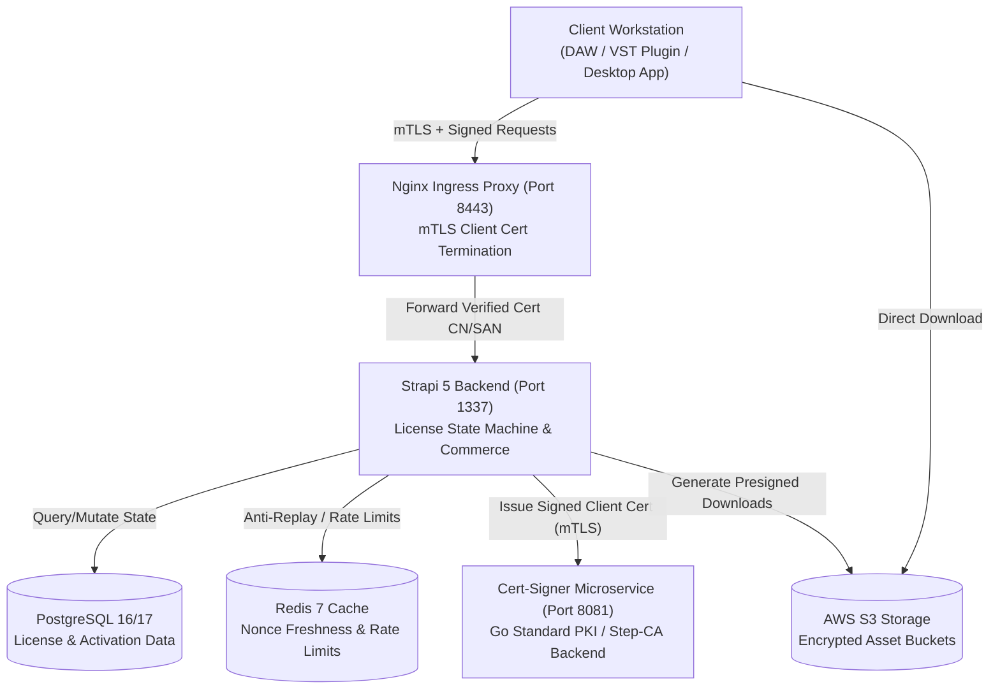
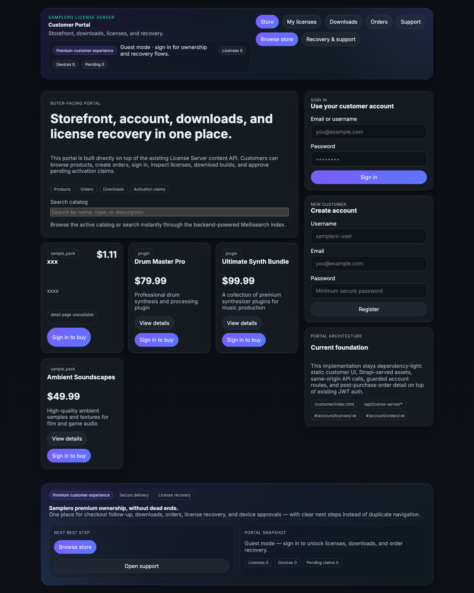
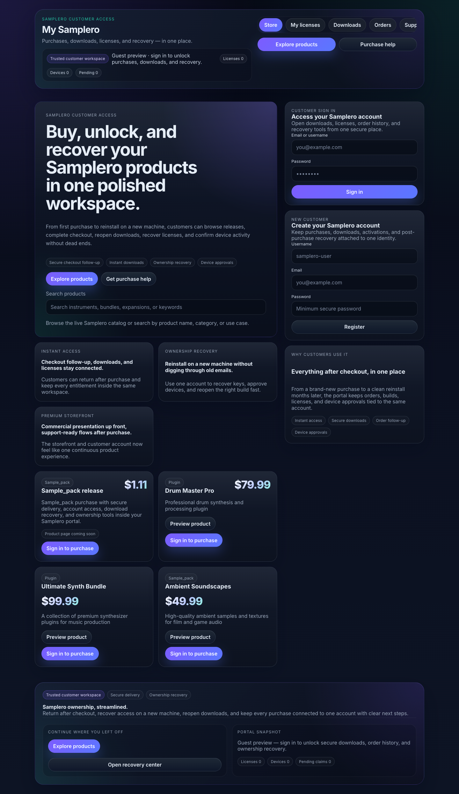
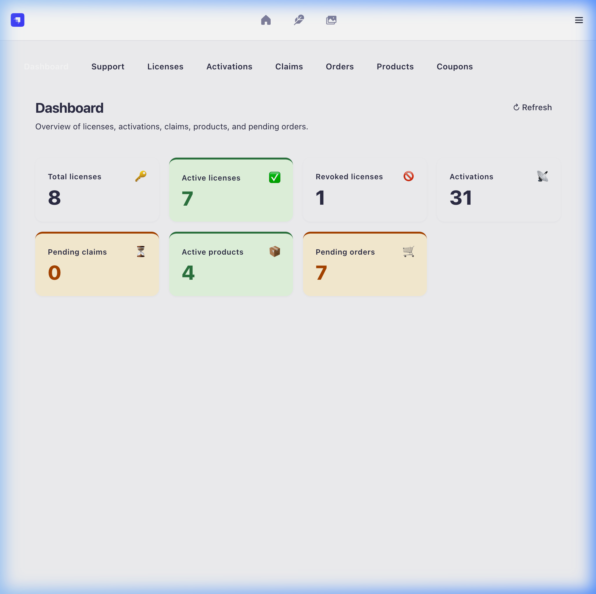
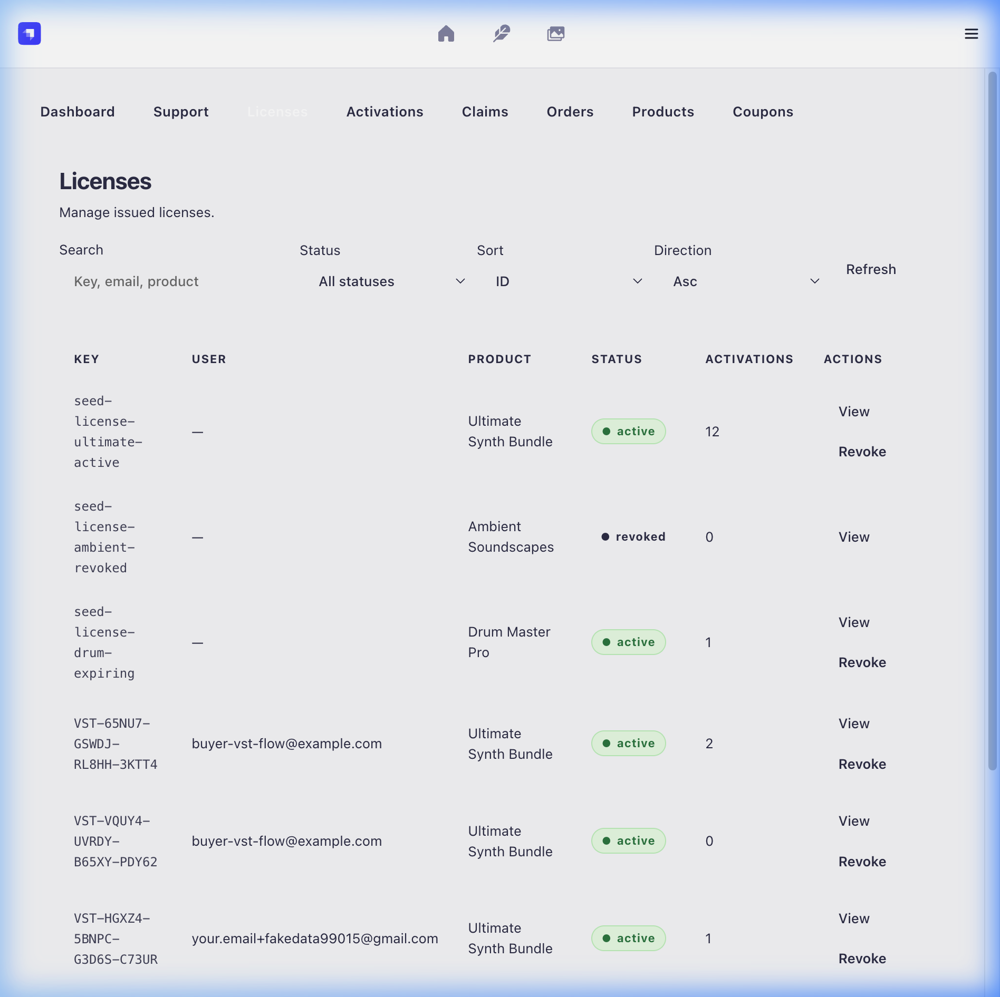

<div align="center">

# 🎹 Samplero License Server
### Google Production Grade Zero-Trust Licensing & Digital Delivery Platform for Audio Software

[](https://nodejs.org/)
[](https://go.dev/)
[](https://strapi.io/)
[](https://tauri.app/)
[](https://flutter.dev/)
[](SECURITY.md)

</div>

---

## 📖 Table of Contents

- [Overview](#-overview)
- [System Architecture](#-system-architecture)
- [Monorepo & Multi-Service Map](#-monorepo--multi-service-map)
- [Security & Cryptographic Model](#-security--cryptographic-model)
- [Quick Start (Local Development)](#-quick-start-local-development)
- [Production Deployment (Docker)](#-production-deployment-docker)
- [Observability & SRE Metrics](#-observability--sRE-metrics)
- [Verification & Testing](#-verification--testing)
- [API Reference](#-api-reference)
- [Visual Showcase](#-visual-showcase)
- [Documentation & Runbooks](#-documentation--runbooks)

---

## 🌟 Overview

**Samplero License Server** is an enterprise-grade digital rights management (DRM), PKI certificate authority, and commerce distribution engine tailored specifically for VST/AU/AAX audio plugins, DAWs, and digital sample libraries.

### Key Capabilities
- **Zero-Trust Mutual TLS (mTLS)**: Every licensed hardware workstation receives an ephemeral X.509 client certificate issued dynamically via CSR.
- **Proof-of-Possession Request Signatures**: Prevents API-key forgery and proxy spoofing with asymmetric HMAC/Ed25519 signatures over canonical query strings and JSON payloads.
- **Anti-Tamper Response Signing**: The server signs all JSON responses (`x-response-signature`), preventing local hosts-file redirection and rogue proxy emulation.
- **Resilient Offline Grace Period**: Seamless offline operation for touring musicians and studio workstations with monotonic clock protection and automatic online heartbeat recovery.
- **Automated Digital Fulfillment**: Webhook-driven payment fulfillment delivering machine-specific VST licenses or archive-only sample pack assets via AWS S3 presigned URLs.

---

## 🏛️ System Architecture


```mermaid
graph TD
    Client["Client Workstation<br/>(DAW / VST Plugin / Desktop App)"]
    Edge["Nginx Ingress Proxy (Port 8443)<br/>mTLS Client Cert Termination"]
    Strapi["Strapi 5 Backend (Port 1337)<br/>License State Machine & Commerce"]
    Signer["Cert-Signer Microservice (Port 8081)<br/>Go Standard PKI / Step-CA Backend"]
    DB[("PostgreSQL 16/17<br/>License & Activation Data")]
    Redis[("Redis 7 Cache<br/>Nonce Freshness & Rate Limits")]
    S3[("AWS S3 Storage<br/>Encrypted Asset Buckets")]

    Client -->|"mTLS + Signed Requests"| Edge
    Edge -->|"Forward Verified Cert CN/SAN"| Strapi
    Strapi -->|"Query/Mutate State"| DB
    Strapi -->|"Anti-Replay / Rate Limits"| Redis
    Strapi -->|"Issue Signed Client Cert (mTLS)"| Signer
    Strapi -->|"Generate Presigned Downloads"| S3
    Client -->|"Direct Download"| S3
```

---

## 🗂️ Monorepo & Multi-Service Map

```
Samplero/
├── apps/
│   ├── customer-tauri/          # Desktop Client (Tauri 2.0 + React + TypeScript + Rust)
│   └── customer_mobile/         # Mobile App (Flutter 3.x / Dart)
├── config/                      # Strapi 5 Configuration (Database, Middlewares, Security, Plugins)
├── docs/                        # Engineering Specifications, Architecture & Runbooks
│   ├── api/                     # OpenAPI 3.1 YAML Specification
│   ├── architecture/            # Architectural Analysis & Roadmaps
│   ├── assets/screenshots/      # UI & Portal Visual Screenshots
│   ├── deployment/              # Debian & Ubuntu Production Deployment Guides
│   ├── runbooks/                # SRE Operational Runbooks (Disaster Recovery, Rotation, Alerts)
│   └── spec/                    # Purchase Contracts & Domain Specifications
├── docker/                      # Hardened Docker Compose & Dockerfiles
│   ├── Dockerfile               # Multi-stage Development Image
│   ├── Dockerfile.prod          # Distroless/Alpine Production Image
│   ├── docker-compose.yml       # Dev/Staging Docker Stack
│   ├── docker-compose.prod.yml  # Production Docker Compose Overlay (Resource Limits, Logging)
│   └── nginx/                   # Edge Nginx Reverse Proxy with mTLS Gate
├── plugins/
│   ├── license-server/          # Core License Server Plugin (Server + Admin UI)
│   └── strapi-plugin-rate-limit/# Distributed Redis Rate Limiting Plugin
├── public/customer/             # Responsive Web Customer Portal
├── scripts/
│   ├── pki/                     # PKI Automation Scripts (Intermediate CA, Step-CA, Bundles)
│   └── k6/                      # K6 Load & Performance Smoke Scripts
├── services/
│   └── cert-signer/             # Lightweight Go Microservice for X.509 CSR Signing
├── src/                         # Strapi Extensions, Custom Middlewares, and Bootstrapping
└── tests/                       # Root Integration & Supertest Test Suites
```

---

## 🔐 Security & Cryptographic Model

| Trust Level | Level Code | Transport | Proof-of-Possession | Target Endpoints |
| :--- | :---: | :---: | :---: | :--- |
| **ANONYMOUS** | `0` | HTTPS | None | Storefront, Products, Version lookups |
| **API_KEY** | `1` | HTTPS | License Key String | Legacy checkouts |
| **CLIENT_CERT** | `2` | mTLS (8443) | X.509 Handshake | Basic device validation |
| **SIGNED** | `3` | HTTPS | Asymmetric Payload Signature | Direct validation fallback |
| **MTLS_SIGNED** | `4` | mTLS (8443) | X.509 Cert + Payload Signature | **Google Production Standard** |

For complete threat modeling and mitigation matrices, consult [`SECURITY.md`](SECURITY.md).

---

## 🚀 Quick Start (Local Development)

### 1. Prerequisites
- **Node.js**: >= 20.x (or **Bun** >= 1.2)
- **Go**: >= 1.24+
- **Docker & Docker Compose**: >= 2.20+

### 2. Setup Environment
```bash
# Clone the repository
git clone https://github.com/bivex/Samplero.git
cd Samplero

# Copy environment template
cp .env.example .env

# Install dependencies
npm install
# Or: bun install
```

### 3. Start Supporting Infrastructure
```bash
# Launch PostgreSQL and Redis
docker compose -f docker/docker-compose.yml up -d strapiDB strapi-redis
```

### 4. Start Development Server
```bash
npm run develop
# Or: bun run develop
```
- **Admin Panel**: `http://localhost:1337/admin`
- **Customer Portal**: `http://localhost:1337/customer`
- **Health Endpoint**: `http://localhost:1337/api/license-server/healthz`

---

## 🚢 Production Deployment (Docker)

To deploy the production-hardened stack on a Linux node:

```bash
# 1. Initialize production Intermediate CA
bash scripts/pki/bootstrap-intermediate-ca.sh

# 2. Build and launch with production overlay
docker compose -f docker/docker-compose.yml -f docker/docker-compose.prod.yml up -d --build

# 3. Verify deployment health
curl -f http://127.0.0.1:1337/api/license-server/healthz
curl -f http://127.0.0.1:1337/api/license-server/readyz
```

For zero-downtime deployment instructions, consult [`docs/runbooks/01-production-deployment-guide.md`](docs/runbooks/01-production-deployment-guide.md).

---

## 📊 Observability & SRE Metrics

Samplero provides native Prometheus metrics and Kubernetes-compatible health probes:

- **Liveness Probe**: `GET /api/license-server/healthz` (200 OK)
- **Readiness Probe**: `GET /api/license-server/readyz` (Verifies DB, Redis, and Cert-Signer connectivity)
- **Prometheus Metrics**: `GET /api/license-server/metrics`
- **Cert-Signer Metrics**: `GET http://127.0.0.1:8081/metrics`

Prometheus metrics include:
- `process_uptime_seconds`, `process_heap_bytes`
- `license_server_licenses_total{status="active|revoked|expired"}`
- `license_server_activations_active_total{platform="mac|windows|linux"}`
- `cert_signer_issued_certificates_total`, `cert_signer_failures_total`

---

## 🧪 Verification & Testing

Every subproject in the repository is covered by automated unit and integration test suites:

```bash
# 1. Run all backend & plugin tests (320+ tests)
npm test
# Or: bun test

# 2. Run Go cert-signer tests
cd services/cert-signer && go test -v ./... && cd ../..

# 3. Run Flutter mobile analysis
cd apps/customer_mobile && flutter analyze && cd ../..

# 4. Check Tauri Rust backend
cd apps/customer-tauri/src-tauri && cargo check && cd ../../..
```

---

## 📚 Visual Showcase

### Customer Portal
| Storefront & Downloads | My Samplero Cabinet |
| :---: | :---: |
|  |  |

### Admin Dashboard & Management
| Dashboard Overview | License Management |
| :---: | :---: |
|  |  |

---

## 📖 Documentation & Runbooks

- [System Architecture & RFC](ARCHITECTURE.md)
- [Security Policy & Key Custody](SECURITY.md)
- [OpenAPI 3.1 Specification](docs/api/openapi.yaml)
- [Production Deployment Runbook](docs/runbooks/01-production-deployment-guide.md)
- [Intermediate CA Rotation Runbook](docs/runbooks/02-intermediate-ca-rotation.md)
- [Disaster Recovery & Backup Runbook](docs/runbooks/03-disaster-recovery-and-backup.md)
- [Incident Response & Revocation Runbook](docs/runbooks/04-incident-response-and-revocation.md)
- [Prometheus Alerting Runbook](docs/runbooks/05-observability-and-alerts.md)
- [Contributing Guidelines](CONTRIBUTING.md)
- [Changelog](CHANGELOG.md)

---

## 📄 License

This project is licensed under the [MIT License](LICENSE).
