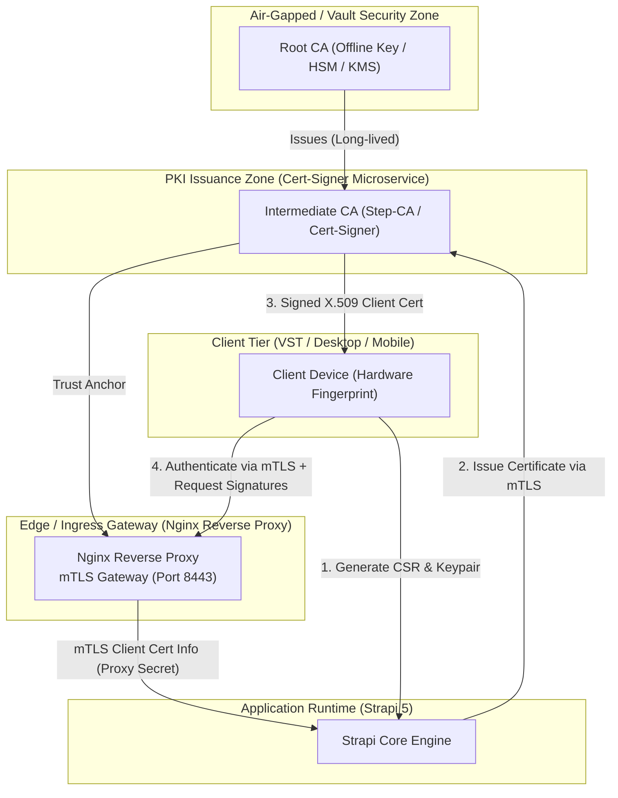

# 🛡️ Security Policy & Cryptographic Architecture

## 1. Security Overview

Samplero License Server implements a **Zero-Trust Defense-in-Depth** security model designed for digital audio workstations (DAWs), VST/AU/AAX plugins, and high-value soundware.

The platform guarantees:
- **Mutual TLS (mTLS) Authentication**: Cryptographic client identity verification per hardware device.
- **Proof-of-Possession**: Asymmetric request signatures (Ed25519/ECDSA) bind every validation to the device private key.
- **Tamper-Proof Response Signing**: Server-signed responses prevent Man-in-the-Middle (MITM) spoofing.
- **Anti-Replay & Freshness Verification**: Monotonic nonces and strict timestamp skew windows enforce freshness across all validation, heartbeat, and webhook routes.
- **Decoupled Key Custody**: Root and Intermediate CA private keys are isolated outside web application runtimes.

---

## 2. Cryptographic Architecture & Trust Hierarchy

### Trust Levels Matrix

| Trust Level | Code | Description | Requirement |
| :--- | :---: | :--- | :--- |
| **ANONYMOUS** | `0` | Unauthenticated public request | Public store/product catalog |
| **API_KEY** | `1` | Legacy / Development key validation | Basic license key lookup |
| **CLIENT_CERT** | `2` | Verified mTLS X.509 certificate | Valid client certificate in TLS handshake |
| **SIGNED** | `3` | Asymmetric Request Payload Signature | Ed25519 / HMAC signature over canonical payload |
| **MTLS_SIGNED** | `4` | Full Google Prod Grade (mTLS + Signature) | Valid Client Cert + Valid Cryptographic Signature |

---

## 3. Threat Model & Mitigations

| Threat Vector | Severity | Attack Description | Platform Mitigation |
| :--- | :---: | :--- | :--- |
| **MITM Response Forgery** | **Critical** | Attacker injects fake `{ "valid": true }` response | Responses signed by server HMAC (`x-response-signature`). Client validates before trusting license. |
| **Replay Attacks** | **High** | Attacker replays intercepted validation payload | Nonce cache with TTL (`x-request-nonce`) and timestamp freshness check (`x-request-timestamp`, max skew 60-300s). |
| **Device Spoofing** | **High** | Copying license key across multiple workstations | Activation limit enforcement + hardware fingerprint hashing + proof-of-possession signature verification. |
| **CSR Poisoning** | **High** | Submitting malicious SANs or CNs in CSR | Signer extracts public key, validates SAN constraints, and enforces deterministic CN naming (`client:<machineId>:<keyHash>`). |
| **Clock Tampering** | **Medium** | Manipulating local machine clock to bypass expiration | Strict grace period leases + online check-in monotonic timestamp comparison. |
| **Timing Attacks** | **Medium** | Side-channel timing analysis on API keys & HMACs | `crypto.timingSafeEqual` / `hmac.Equal` used throughout all authorization flows. |

---

## 4. Key Custody & Secrets Management

1. **Root CA**:
   - Must be kept strictly **offline** in air-gapped storage or AWS KMS / Google Cloud HSM.
   - Root CA keys must **never** be mounted on production runtime containers.
2. **Intermediate CA**:
   - Stored in a restricted filesystem path (`chmod 600`) accessible only by `cert-signer` / `step-ca` service account (`UID 65532`).
   - Rotated on a scheduled 90-365 day lifecycle.
3. **Client Certificates**:
   - Issued directly from client-generated CSRs (private keys never leave client devices).
   - Valid for 365 days; revoked automatically on device deactivation or license cancellation.

---

## 5. Vulnerability Disclosure Policy

If you discover a security vulnerability in Samplero License Server, please disclose it responsibly:

- **Email**: `security@b-b.top` (or `support@b-b.top`)
- **PGP Key**: Available upon request
- **Response SLA**:
  - Initial Acknowledgement: **within 24 hours**
  - Triage & Severity Assignment: **within 48 hours**
  - Fix & Patch Release: **within 7 business days** (Critical: < 48 hours)

Please do not disclose security issues publicly before a patch has been released and coordinated.
