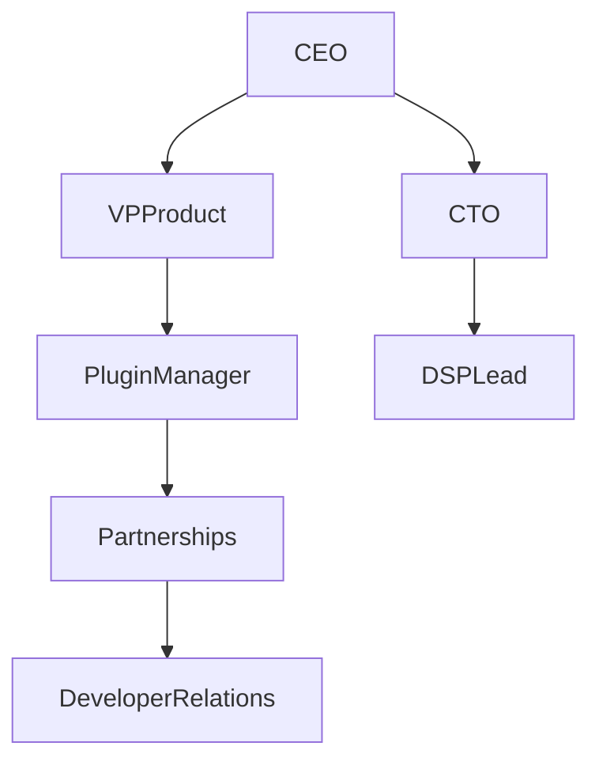

# Potential Clients for VST Plugins

## Target Customer Analysis

The main buyers of VST plugins are:
- DAW companies (integration and bundle deals)
- Audio plugin marketplaces
- Music tech companies
- Sample library companies
- Hardware synth brands
- Streaming/creator platforms

### Potential Target Companies

| Priority | Company            | Industry            | Why a Good Client                  |
| -------- | ------------------ | ------------------- | ---------------------------------- |
| 🔥 P1    | Native Instruments | Music software      | Large plugin ecosystem, Kontakt    |
| 🔥 P1    | Ableton            | DAW                 | Ableton Live + Max for Live        |
| ⭐ P2     | Steinberg          | DAW / VST standard  | Creators of VST format             |
| ⭐ P2     | Splice             | Plugin marketplace  | Plugin subscription                |
| ⭐ P2     | Plugin Alliance    | Plugin distribution | Marketplace for plugins            |
| ⭐ P3     | Universal Audio    | Pro audio           | UAD plugins                        |
| ⭐ P3     | Arturia            | Synth / plugins     | V Collection                       |
| ⭐ P3     | iZotope            | Audio processing    | RX, Ozone                          |
| P4       | Image-Line         | FL Studio           | Large user base                    |
| P4       | PreSonus           | Studio One DAW      | Plugins and hardware               |

---

## Best Sales Channels for VST Plugins

1. Marketplace: Splice, Plugin Alliance
2. Bundle/Partnership: Native Instruments, Arturia
3. DAW Integration: Ableton, Steinberg

---

## Typical Decision Chain (Audio Software)

- Final Decision: CEO, Founder
- Strategic Layer: VP Product, CTO
- Key Influencers: Head of Plugins, DSP Lead, Product Manager (Audio)
- Entry Points: Developer Relations, Partnerships Manager

---

## Flanking Strategy

Best strategy for VST:
1. Partnerships manager
2. Head of Plugins / Product Manager
3. VP Product
4. Deal/integration

---

## Fastest Sales Strategy

1. Splice marketplace
2. Plugin Alliance distribution
3. Bundle deals with DAW

---

## Next Step

Choose a company, and I will build a full Power Map with key people and contacts.

Examples:
- Ableton
- Native Instruments
- Splice
- Plugin Alliance
- Arturia

Reply with the company name to proceed.

---

## Competitive Landscape

To sharpen your positioning, consider the competitive landscape:

- **Existing Plugin Publishers**: Waves, FabFilter, iZotope – they offer similar audio processing tools and often bundle plugins with DAWs or sell directly.
- **New AI/ML Audio Startups**: Companies building generative audio tools (e.g., AIVA, Amper Music, Sonantic) may cross over into VST territory.
- **Open‑Source Communities**: Developers around JUCE/FAUST who release free or low‑cost plugins can undercut pricing.
- **Hardware Integration Vendors**: Akai, Novation, Arturia hardware bundles compete with purely software offerings by including their own plugins.

Understanding these competitors will help in crafting unique selling points and identifying partnership opportunities, such as offering proprietary DSP or novel UI features that set your VST apart.